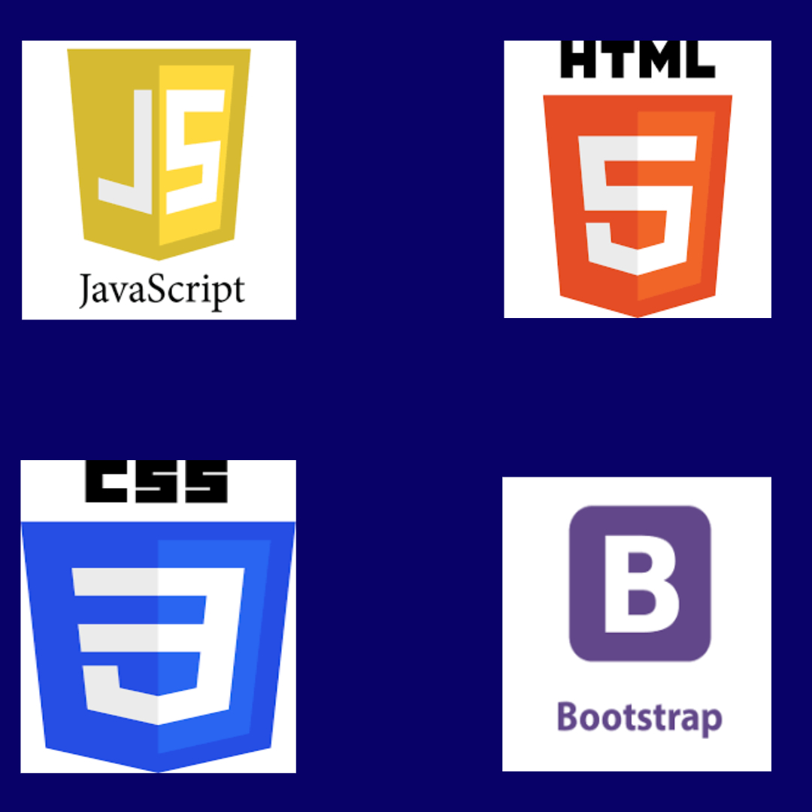
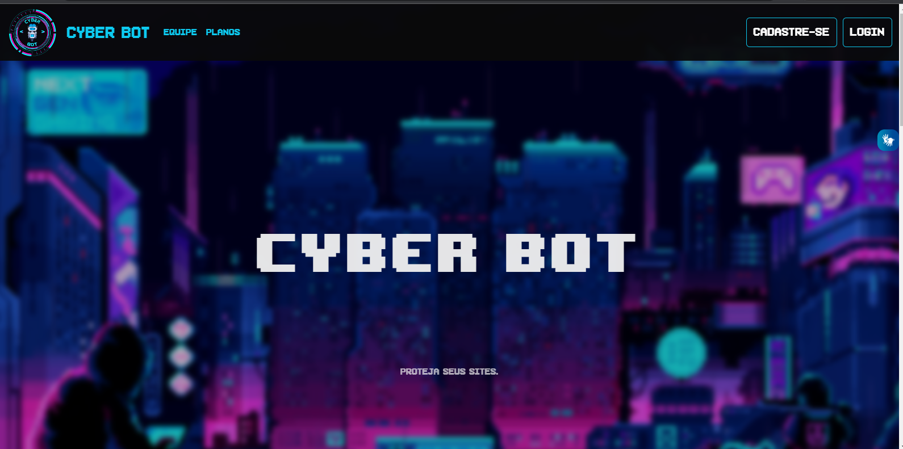
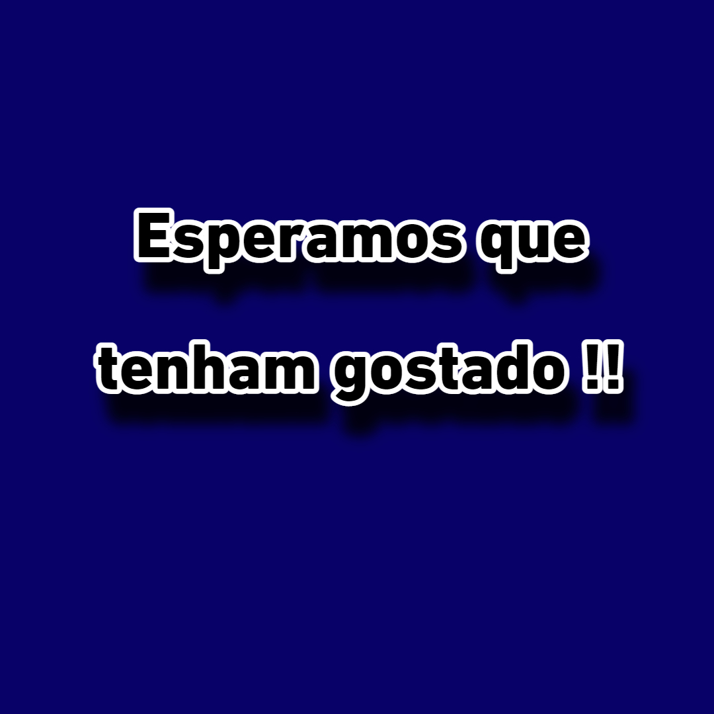

<h4 align="center">Esse é o projeto de fim do módulo 2 da squad 3 pela RESILIA educação.
</h2>

<a href="#Sobre">*Sobre nós*</a>
<a href="#Tec">*Tecnologias utilizadas*</a>
<a href="#Page">*A página*</a>
<a href="#Devs">*Desenvolvedores*</a>
<a href="#Fim">*Fim*</a>  

<h1 id="Sobre" align="center">🤔Quem somos?🤔</h1>

A Cyber Bot é uma empresa de proteção de dados. Vendemos pacotes de bots para empresas que querem segurança para seus dados.

Aqui dentro, nossos valores são voltados para ajudar grandes e pequenas empresas e pessoas inexperientes na área, para entrar pro mercado de trabalho de forma segura.  

<h1 id="Tec" align="center">🖥️Como o projeto foi construído?🖥️</h1>

  

  

<h1 id="Page" align="center">🌐Nossa página🌐</h1>

  
Link para a página: [Cyber Bot](https://tamiresporto.github.io/Front_Enders/)
  
 

  
  
  

<h1 id="Devs" align="center">🕹️Nossos Devs🕹️</h1>

  

  
[--Bruna Lima--](https://github.com/brwnalima) [--Ester Ramos--](https://github.com/EsterM99) [--Maicon Brendon--](https://github.com/Maiconbre) [--Tamires Porto--](https://github.com/Tamiresporto) [--Silvia Corrêa--](https://github.com/Scorrea03)

  
 

<h1 id="Fim" align="center">🤗Por fim🤗</h1>

  

<h1> OBS: A aluna Bruna fez um commit em outro computador e infelizmente o github desktop estava aberto com a conta da aluna Rannyelle.</h1>
 
 

